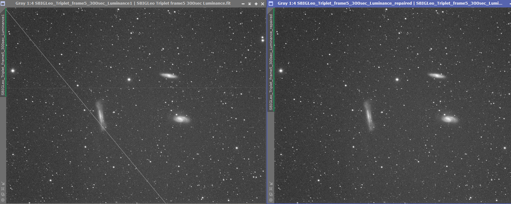
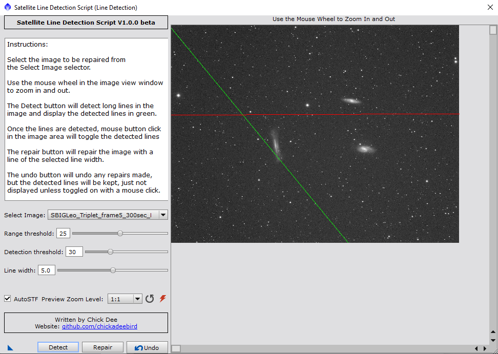

# Satellite-Line-Repair

This is a Pixinsight script for repairing satellite lines through light frames.

This will work only on mono images at present. RGB will be added as an update in the future.

The script will display any available image window in its image window frame.
The user can set the range threshold slider (default 25) and the detection threshold slider (default 50) and then select the "Detect" button at the bottom of the panel.
It may take a while depending on the computer hardware and the size of the image, but satellite lines will be detected and displayed in red or green in the
script image window. Computation speed optimizations are coming in the future.

The range threshold sets the threshold of the mask range. Lower numbers means more lines detected, but more noise in the initial estimate and therefore more time to compute, and a greater chance of detecting non-satellite lines.

The detector threshold sets the threshold of the Hough Line Peak algorithm. Lower numbers means more lines detected, nbut a greater chance of detecting non-satellite lines. Set to lower if there are multiple lines of varying intensities, otherwise 50 should work.

Once lines are detected, they should be displayed on the view panel in red or green and can be toggled on and off with a mouse click in the script image window. If the detections are imperfect, changing the thresholding parameters and rerunning the script should display freshly detected lines, discarding the previous detected lines.

After the detected lines are satisfactory, the "Repair" button will apply a repair mask to the image and replace the lines with a local median value. Both the script image window and the image displayed in the main Pixinsight window should update.

The undo button should undo the changes both to the script image window and the image displayed in the main Pixinsight window.

I should probably say that "this script should not replace good acquisition practices of acquiring many images with appropriately-set Windorized sigma values...", but some of us live in cloud city and only see clear skies once or twice a season (exaggerating of course), so this is meant to optimize an unlucky run of fewer images than desired that can only be suboptimally processed, or whatever you feel you need to do.

## Uses

The script works on the satellite line problem below.

## Images

This is a sample pair of images taken of the Leo Triplet, 5 minutes, Luminance.

## Script

This is the script interface.

## Manage repository location

In order to automatically install and subsequently refresh script updates in Pixinsight, add the following URL to Resources > Updates > Manage repositories

https://raw.githubusercontent.com/chickadeebird/Satellite-Line-Repair/main/

After this has been added to the repositories, Check for updates should place the new LineRepair script in Scripts > ChickadeeScripts
